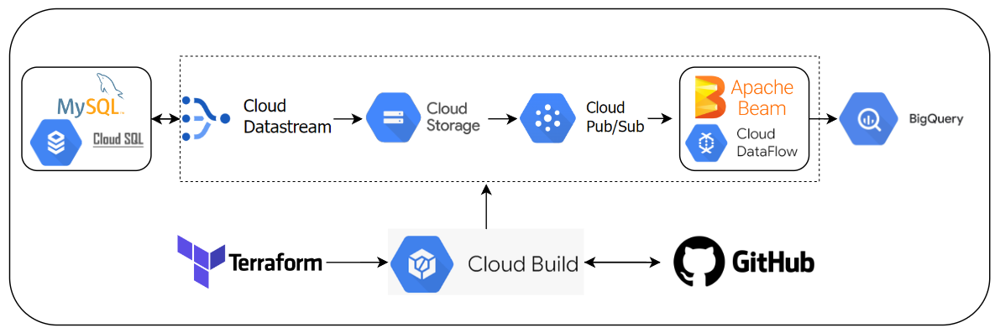

# Projeto de Engenharia de Dados: Versionamento de Tabelas com Streaming de Dados usando Dataflow 

## Introdução

Dentro do meu ambiente de trabalho, nos deparamos com tabelas em bancos transacionais que passam por edições e exclusões físicas de registros, resultando na impossibilidade de consultar seus históricos, sendo possível apenas visualizar o seu estado atual. 

Este projeto tem como objetivo desenvolver uma pipeline capaz de versionar os registros dessas tabelas, criando um histórico acessível em tempo real para a área de negócios. Para lidar com os dados em tempo real, optamos pelo uso de tecnologia de streaming, especificamente o Apache Beam, executado no ambiente em nuvem da Google (GCP) por meio de um job no Dataflow. Além disso, para capturar as alterações nos registros do banco, utilizaremos um serviço de Captura de Dados Alterados (CDC) gerenciado no GCP chamado Datastream. 

## Tecnologias Utilizadas

- **MySql:** banco de dados relacional no qual está armazenado as tabelas que serão versionadas. 
- **CloudSql:** serviço gerenciado de banco de dados relacional na Cloud do Google utilizado para o Mysql. 
- **Data Stream:** serviço gerenciado que irá capturar os dados alterados (CDC) no banco MySql.
- **Cloud Data Storage:** modelo de armazenamento de objetos que será utilizado para armazenar logs e scripts necessarios para o projeto.
- **Pub Sub:** serviço de mensageria, capaz de notificar o recebimento de novos logs de alterações de registos das tabelas.
- **Data Flow:** serviço gerenciado de execução de scripts stream ou lote.
- **Apache Beam:** framework utilizado para o desenvolvimento de pipelines ETL’s em stream e lote.
- **BigQuery:** Um sistema de armazenamento na nuvem no qual será armazenada a tabela final com os dados versionados.
- **Clound Build:** Servico que possibilita implementar o deploy automatico da infraestrutura na nuvem, funcionando de forma integrado ao GitHub.
- **GitHub:** Repositório responsável pelo versionamento do codigo, sendo também o gatilho do Cloud Build sempre que sofrer novas alterações. 
- **Terraform:** Ferramenta que permite o provisionamento eficiente de toda a infraestrutura necessária, seguindo a metodologia de Infraestrutura como Código (IaC).
- **Docker:** Utilizado para criar imagens que servirá como base do template que será utilizado no dataflow.

 

 

## Arquitetura

## Etapas do Projeto

O provisionamento da infraestrutura é conduzido através do Terraform, sendo organizado em três pastas distintas. A primeira pasta, denominada [cloudsql](build/cloudsql/), é utilizada para a configuração inicial do banco de dados, criando a instância necessária. A segunda, chamada [stream](build/stream/), abrange a provisão completa da infraestrutura do projeto, desde a criação do script até a configuração do Datastream. Por fim, a última pasta, chamada [trigger](build/trigger/) é responsável por configurar uma trigger no Cloud Build associada a um repositório. Dessa forma, sempre que uma mudança é realizada no script ou na infraestrutura, basta fazer um commit no Git para que o deploy seja automaticamente acionado. 

### 1. Configuração do banco de Dados

Como etapa inicial, é necessário ter um banco de dados devidamente configurado, pois este será a fonte de onde geraremos as tabelas versionadas. No contexto deste projeto, optamos por utilizar um banco de dados MySQL hospedado no CloudSql do GCP. Embora seja possível utilizar outros Sistemas Gerenciadores de Bancos de Dados (SGBD), alguns ajustes na configuração da conexão no Datastream são necessários. Para provisionar o banco de dados, utilizamos um script em Terraform [cloudsql.tf](build/cloudsql/cloudsql.tf), que cria a instância do banco de dados MySQL, configura um usuário para consultas e ajusta algumas flags para ativar os logs binários do banco. Essa ativação é crucial para que o serviço de CDC possa identificar as mudanças nas tabelas. 

### 2. Criação do Bucket e Tópico no Pub/Sub 

Posteriormente, é necessário criar um bucket para receber todos os logs com informações de alteração das tabelas desejadas. Após a criação do bucket, é essencial também criar um tópico no Pub/Sub, atuando como uma fila de mensagens que gera uma notificação sempre que um novo log ou objeto é inserido no bucket. Para que o Cloud Storage funcione como um publicador do Pub/Sub, é necessário configurar uma flag no bucket, o que também é feito usando o Terraform no arquivo [stream.tf](build/stream/stream.tf). 

### 3. Criação do Script no Apache Beam

Em seguida, configuramos um script capaz de lidar com streaming de dados, funcionando como um assinante do tópico do Pub/Sub criado anteriormente. Esse script recebe uma nova notificação sempre que um novo objeto é adicionado ao Cloud Storage. Ele lê essa notificação, que contém o caminho do novo objeto, e, posteriormente, lê o próprio log. O log inclui informações sobre a ação no banco (inserção, exclusão ou atualização), os detalhes da linha e quando a ação ocorreu. O script processa esse log e escreve o resultado da alteração em uma linha de uma tabela no BigQuery. Registrando todos os eventos do banco, o script possibilita o versionamento completo dos registros da tabela. No caso de uma deleção, por exemplo, é inserida uma nova linha em branco indicando que o registro foi deletado fisicamente. Através do ID da linha e da data de alteração, a presença ou ausência na consulta depende do momento em que a informação é buscada. Todo o script é desenvolvido usando o Apache Beam, um framework capaz de trabalhar tanto em lote quanto em streaming. O executor desta rotina na nuvem é o Dataflow. unto do script [dataflow-cdc-stream.py](src/dataflow-cdc-stream.py), temos também [data-stream.json](src/data-stream.json), arquivo json com os schemas das tabelas necessários para executar o código.

Geralmente, o Dataflow possui alguns templates prontos. No entanto, como é necessário um script personalizado, é preciso criar um template próprio. Isso envolve a criação de uma imagem Docker através de um [Dockerfile](src/Dockerfile) com o código desejado, além de um arquivo JSON chamado [metadata.json](src/metadata.json), que contém todos os parâmetros do script. A partir desses dois elementos, um template flex é gerado, utilizado para criar o job no Dataflow. A criação do template é feita por meio de comandos gcloud, executados por uma trigger do Cloud Build (a ser discutida posteriormente). Não foi possível utilizar o Terraform para esta etapa, pois a criação do template ainda não possui suporte dentro do Terraform. Posteriormente, a criação e ativação do job no Dataflow, com base no template criado anteriormente, são realizadas usando o Terraform. 

### 4. Configuração do Datastream

Com o banco de dados em funcionamento, seus logs binários ativados e o job do Dataflow já operacional, é hora de configurar o Datastream. Este serviço gerenciado é responsável por enviar os logs de alterações de registro para o bucket criado anteriormente. A configuração do Datastream é a última etapa, garantindo que os logs iniciais não sejam perdidos até o início do funcionamento do script no Dataflow. 

Para iniciar a configuração do Dataflow, serviço gerenciado de captura de alterações (CDC) de banco do GCP, lemos os logs binários do banco de dados e identificamos qualquer tipo de alteração em suas tabelas, desde deleção, edição até inserção. Como etapa inicial da configuração, é necessário criar uma conexão com o MySQL, além de criar um usuário para o Dataflow no MySql conforme orientações na documentação deste. Por fim, é necessário definir onde o Dataflow armazenará as alterações, seja no BigQuery ou no Cloud Storage. O problema da primeira opção é que o resultado é uma tabela igual à tabela de origem. Em casos de edição do registro, teremos apenas o último registro, o que não atende ao projeto, pois o objetivo é capturar o histórico completo. Para isso, usamos o Cloud Storage, pois nele teremos todos os logs, sendo possível processá-los e armazenar no BigQuery todos os registros versionados. Toda essa configuração é feita usando o arquivo Terraform [stream.tf](build/stream/stream.tf). 

### 5. Criação da Trigger do Cloud Build

Basicamente, todas as etapas mencionadas da etapa 2 até 4 são realizadas por meio de um único script do Terraform. A função agora é configurar uma trigger usando o Cloud Build. Assim, sempre que houver uma alteração no script, na infraestrutura do projeto ou na inclusão de novas tabelas no CDC, basta realizar um novo commit no repositório configurado, e um deploy automático de toda a infraestrutura será acionado, seguindo as boas práticas de CI e CD. Para isso foi privionado o trigger no cloud build e definido a conexao com o repositório através do arquivo de terraform [trigger.tf](build/trigger/trigger.tf) junto do [cloudbuild.yaml](cloudbuild.yaml). 

## Pré-Requisitos

Para executar o código deste projeto, é necessário possuir uma conta no Google Cloud Platform (GCP). Além disso, é necessárop ter o aplicativo Terraform e o CLI Cloud instalados localmente em sua máquina.

## Executando o Projeto

Para execução do codigo é necessário possuir terraform instalado na máquina local, uma conta no GCP com criação de um usuário de serviço com acesso a todos os servicos mencionados no projeto. 

## Executando o Projeto

1. Copie o diretório do projeto para uma pasta local em seu computador.
2. Abra o terminal do seu computador e mova até o diretório do projeto.
3. Crie uma conta de servico no GCP com a credencias a todos os serviços mencionados, baixe uma chave em um arquivo json e coloque o arquivo no diretório build com nome creds_terraform.json
4. Mova para  pasta /build/cloudsql e execute os comandos: `terraform init`, `terraform plan`, `terraform apply`.
5. Crie um arquivo json github_token.json, e crie uma chave github_token com o respectivo token da sua conta do github.
6. Vá ao arquivo variaveis do terraform e subsitua pelos seu respectivo valores.
7. Crie um repositorio no git hub e suba todo o codigo do projeto.
8. Mova para  pasta /build/trigger e execute os comandos: `terraform init`, `terraform plan`, `terraform apply` ,sempre que for feito um novo commit a infraestrutura sera executada.

